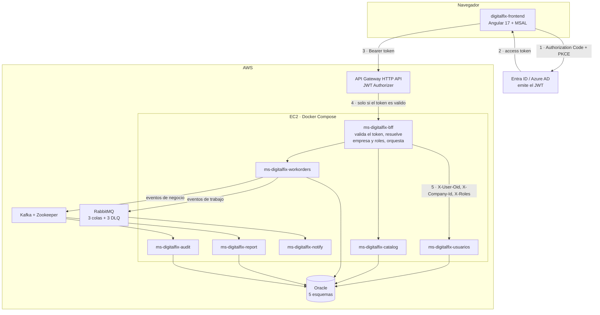

# Arquitectura · DigitalFix

## Componentes

## Flujo de una petición

1. El SPA obtiene un token del IDaaS con **Authorization Code + PKCE**. Es un
   cliente público: nunca lleva secreto.
2. El token pide el scope de **nuestra propia API**, no `User.Read`. Su `aud` es
   `api://<api-client-id>`.
3. Toda llamada sale con `Authorization: Bearer <token>` hacia el API Gateway.
4. El **JWT Authorizer** del gateway valida emisor, audiencia y vigencia. Lo que
   no pasa, no llega al backend.
5. El **BFF vuelve a validar el token**. No confía en que alguien más lo hizo:
   es la diferencia entre una defensa en profundidad y una sola puerta.
6. El BFF resuelve empresa y roles desde `APP_USER` por el `oid`, y propaga
   `X-User-Oid`, `X-Company-Id` y `X-Roles` a los microservicios de dominio.
7. Cada microservicio filtra por `company_id` en su capa de datos. Un recurso de
   otra empresa devuelve `404`, nunca `403`.

El paso 5 es el que la rúbrica de la EP1 evalúa con 40 %, y el 3 y el 4 son lo
que exige para llegar al 80 % y al 100 %.

## Por qué hay un BFF

El caso lo pide explícitamente, pero además resuelve un problema real: el
frontend no debería conocer siete direcciones distintas ni componer respuestas de
varios servicios. El BFF expone una sola superficie, traduce errores y es el
único lugar donde se decide qué empresa y qué roles tiene quien llama.

## Comunicación entre servicios

| Tipo | Cuándo | Ejemplo |
|---|---|---|
| HTTP síncrono | El que llama necesita la respuesta para continuar | Órdenes consulta al catálogo si hay stock antes de asignar |
| RabbitMQ | Trabajo que puede hacerse después sin bloquear al usuario | Aviso de cambio de estado, ticket de despacho, informe técnico |
| Kafka | Flujo de eventos que varios consumen de forma independiente | Auditoría y reportería consumen los mismos eventos sin saber una de otra |

La regla: si el usuario tiene que esperar el resultado, es HTTP. Si no,
es un mensaje. Un servicio de avisos caído no puede impedir que se cierre una
orden.

## Despliegue

Una instancia EC2 con Docker Compose. El API Gateway integra por HTTP contra el
BFF, nunca contra un microservicio de dominio. El grupo de seguridad abre solo
los puertos necesarios y nada administrativo a `0.0.0.0/0`.

Ninguna credencial vive en los repositorios: todo llega por variables de entorno.
