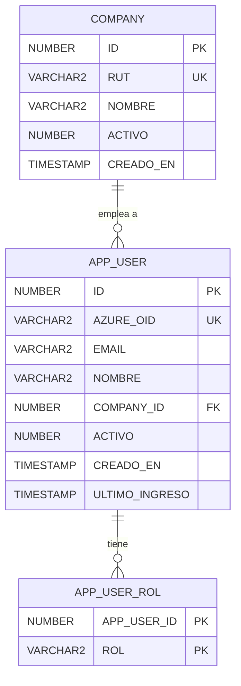
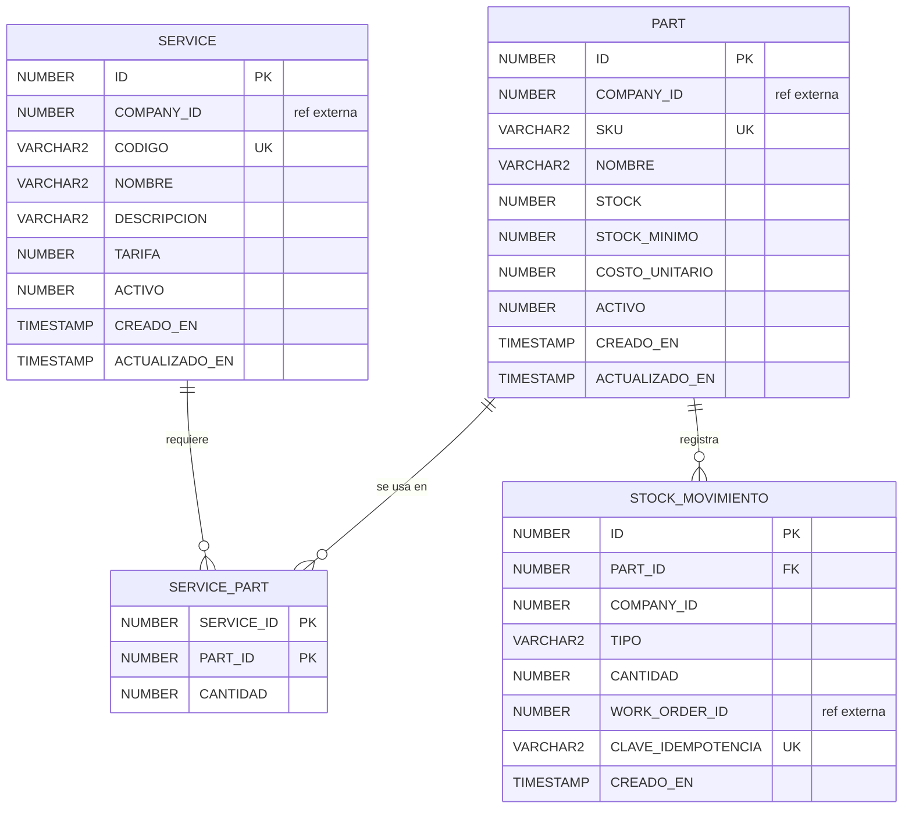
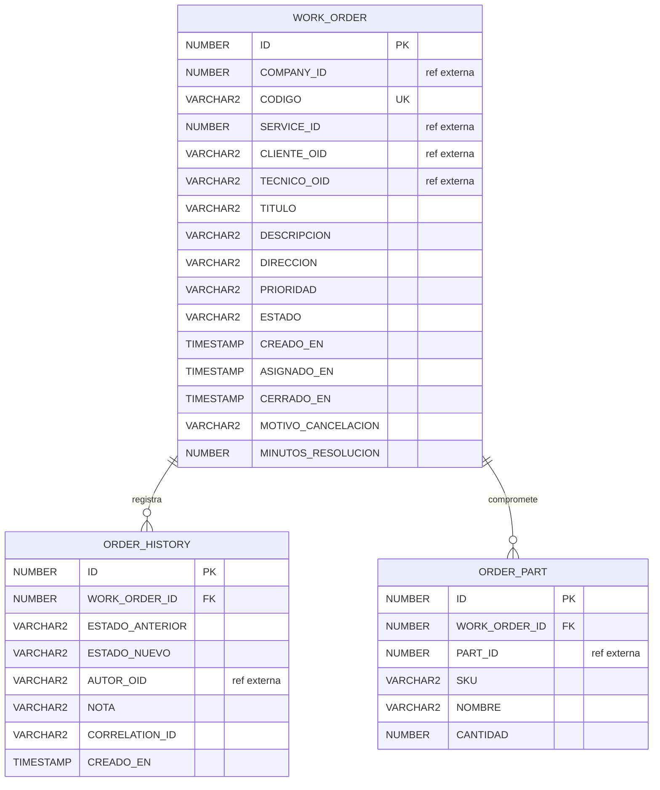
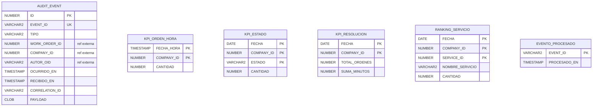
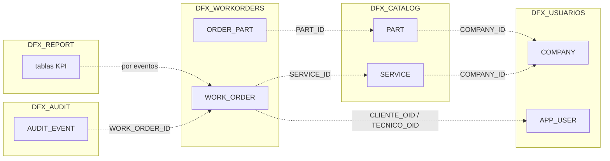

# Diagrama entidad-relación

Cada bloque es un esquema distinto, propiedad de un microservicio. Las líneas
punteadas del final son referencias entre esquemas: se guardan como identificador
suelto, **sin clave foránea**.

## DFX_USUARIOS

## DFX_CATALOG

## DFX_WORKORDERS

## DFX_AUDIT y DFX_REPORT

## Referencias entre esquemas

